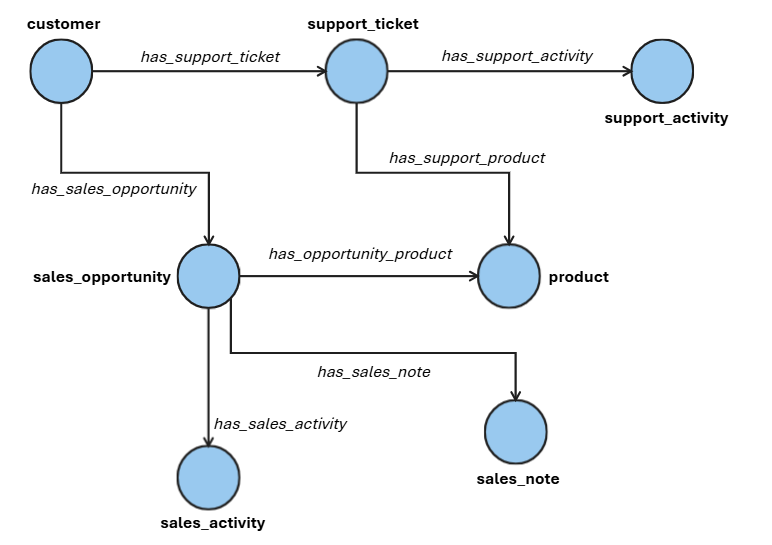

# Experimenting with Data Agents and Ontologies in Fabric IQ

This repository provides utilities for experimenting with Data Agents and Ontologies in Fabric IQ. Accelerating Data Agent initiatives typically requires overcoming common challenges: sourcing or generating use‑case‑representative datasets, iterating on semantic modeling strategies and agent instructions, and defining robust evaluation frameworks to verify alignment with business objectives. For business‑data scenarios, the chosen data modeling paradigm—delta tables, semantic models, or ontologies—becomes an integral part of the AI system and must be explicitly evaluated.

## Requirements 

A typical workflow for experimenting with ontologies in specific use cases includes the following steps:
- When data is available, ingest it into a Fabric Lakehouse, create an ontology using the Fabric portal, and bind the ontology to the source data
- When data is not readily available, use vibe‑coding tools (e.g., GitHub Copilot) to generate both the ontology and the corresponding realistic data in a Lakehouse 
- Generate a ground‑truth dataset
- Configure and evaluate Data Agents—either in Fabric or alternative frameworks—against the ground truth, experimenting with different instructions and semantic layers (e.g., ontologies, Power BI semantic models, or Lakehouse tables)

Guidance and notebooks are provided to support this workflow, accelerating the journey from ideation to implementation. These materials are intended as an enablement accelerator, not as a prescriptive, step‑by‑step guide.

### Example

This repository presents a concrete *Lead‑to‑Cash* (L2C) example for managing sales opportunities in a software company, covering:
- Sales pipeline health
- Opportunity lifecycle progression and risk
- Customer renewals
- Support performance and customer satisfaction

The following schema represents the provided ontology:

Typical prompts for the L2C ontology include:
- Top 10 opportunities most likely to slip in February 2026 and why
- Renewals at risk in Q1 2026 due to low expansion or high incident rates
- Which opportunities closing in H1 2026 can be accelerated

## Components

The following components are provided in this repository.

### Ontology & Data Generator

Currently, only the L2C ontology and related lakehouse are provided. If you already have data, building an ontology directly in Fabric portal is easy.

In case you need to generate the ontology and representative data from scratch, vibe code it - follow the following [video](https://github.com/microsoft/Fabric-IQ-and-Real-Time-Intelligence-assets/blob/main/Repo%20assets/Vibe%20coding%20Ontology.mp4"):

 <video controls src="https://github.com/microsoft/Fabric-IQ-and-Real-Time-Intelligence-assets/blob/main/Repo%20assets/Vibe%20coding%20Ontology.mp4"></video>

### Ground Truth Generation

Generating high‑quality ground truth is non‑trivial. We propose the following methodology, implemented in a reusable notebook:

- Seed a small set of manually curated test cases, each pairing a business prompt with a query used to retrieve the relevant data. In the L2C example, this consists of three business prompts and their associated Lakehouse SQL queries.
- Manually derive simple variations from the seed cases. Although such variations could be auto‑generated, doing so would require additional validation. The L2C example uses manual variations (e.g., adjusting time horizons, filtering by different products, or overriding policies defined in Data Agent instructions).
- Use an LLM to generate prompt rephrasings while keeping the underlying queries unchanged.

The L2C example starts from three seed test cases, each expanded with three manual variations and three LLM‑generated rephrasings, resulting in a total of 27 test cases.

### Data Agent Generator

Notebooks are provided to generate two Fabric Data Agents (one using the L2C ontology and one using the corresponding lakehouse). These serve as reusable templates for creating additional Data Agents. 

### Evaluation

Evaluation uses the Fabric Data Agent SDK with a custom LLM-as-judge prompt. The evaluation notebook can be reused as a template.

## Provisioning in your environment

To provision the L2C example end-to-end, clone the GitHub repository and create a Fabric workspace linked to it. 

In case you wanted to experiment with your own data, reuse the provided notebooks as examples.